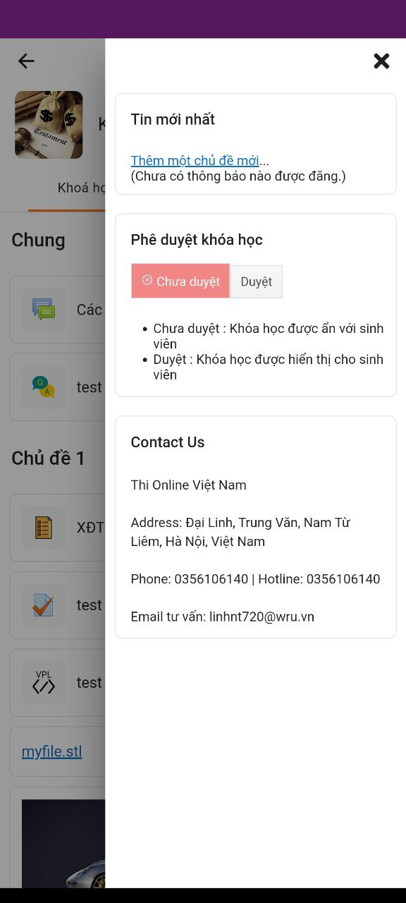
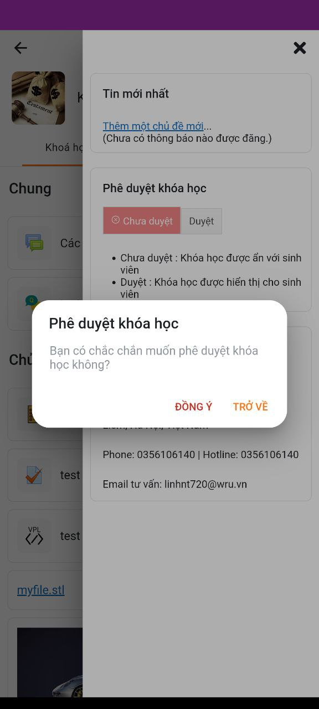
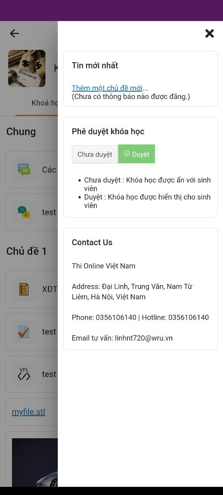
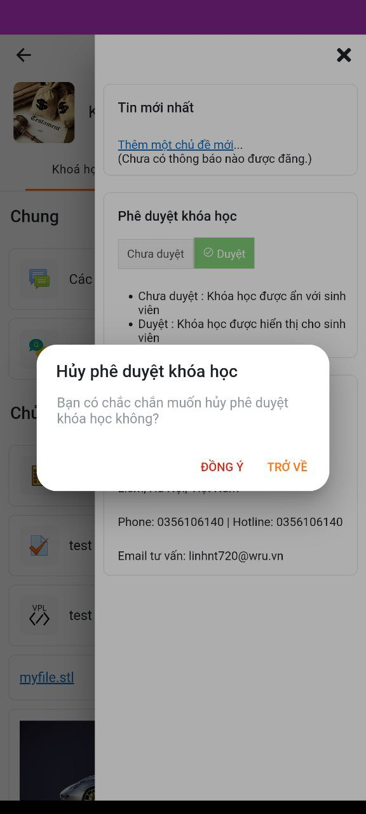

- [1. Hướng dẫn tạo một custom block đơn giản cho Mobile App](#1-hướng-dẫn-tạo-một-custom-block-đơn-giản-cho-mobile-app)
  - [1.1. Cấu trúc file](#11-cấu-trúc-file)
    - [1.2. pluginname.module.ts](#12-pluginnamemodulets)
    - [1.3. block-handler.ts](#13-block-handlerts)
    - [1.4. Import block vào block.module.ts](#14-import-block-vào-blockmodulets)
    - [1.5. Block Course status](#15-block-course-status)
    - [1.5.1. Yêu cầu:](#151-yêu-cầu)
    - [1.5.2. Mô tả chi tiết/ hướng dẫn sử dụng/ hướng dẫn cài đặt](#152-mô-tả-chi-tiết-hướng-dẫn-sử-dụng-hướng-dẫn-cài-đặt)
    - [1.5.3. Cấu trúc file](#153-cấu-trúc-file)
    - [1.5.4. Phân tích thiết kế (database, functions nếu cần)](#154-phân-tích-thiết-kế-database-functions-nếu-cần)
    - [1.5.5. Tạo các file cần thiết](#155-tạo-các-file-cần-thiết)
    - [1.5.6. Mã nguồn chi tiết](#156-mã-nguồn-chi-tiết)

# 1. Hướng dẫn tạo một custom block đơn giản cho Mobile App
## 1.1. Cấu trúc file
```
src/addons/block/pluginname/
 |-- service
 |   -- block-handler.ts
 |-- pluginname.module.ts
```
### 1.2. pluginname.module.ts
- File này sẽ giữ định nghĩa của block và được sử dụng để khai báo nó như một plugin và chứa cách để render giao diện của block.
- Sample code:
  ```ts
    @NgModule({
    providers: [
        {
            provide: APP_INITIALIZER, // Token thực thi trong quá trình khởi tạo app
            multi: true, // cho phép một token giữ nhiều giá trị
            useValue: () => {
                CoreBlockDelegate.registerHandler(AddonBlockPluginnameHandler.instance);
            }, // Function được sử dụng để thực thi
        },
    ],
    })
    export class AddonBlockPluginnameModule {}
  ```
### 1.3. block-handler.ts
- File này sẽ cung cấp thông tin về block sẽ render.
- Sample code:
  ```ts
    /**
    * Block handler.
    */
    @Injectable({ providedIn: 'root' })
    export class AddonBlockPluginnameHandler extends CoreBlockBaseHandler {

        name = 'AddonBlockPluginname';
        blockName = 'pluginname'; // trùng tên block ở web server VD: html

        /**
         * Returns the data needed to render the block.
        *
        * @param block The block to render.
        * @returns Data or promise resolved with the data.
        */
        getDisplayData(block: CoreCourseBlock): CoreBlockHandlerData {

            return {
                title: block.contents?.title || '',
                class: 'addon-block-pluginname',
                component: CoreBlockPreRenderedComponent,
            };
        }

    }

    export const AddonBlockPluginNameHandler = makeSingleton(AddonBlockPluginNameHandlerService);

  ```
### 1.4. Import block vào block.module.ts
- Thêm import đường dẫn cho AddonBlockPluginnameModule
```ts
...
import { AddonBlockPluginnameModule } from './pluginname/pluginname.module';
...
```
- Thêm AddonBlockPluginnameModule vào imports NgModule
```ts
@NgModule({
  imports: [
    ...
    AddonBlockPluginnameModule,
    ...
  ]
})
```
### 1.5. Block Course status
### 1.5.1. Yêu cầu:
- Phê duyệt khóa học trên App cho giảng viên. Khối phê duyệt sẽ không hiển thị đối với học viên.

- Lưu ý: Khối phê duyệt chỉ xuất hiện khi khối phê duyệt đã được thêm vào khóa học trên Web.

### 1.5.2. Mô tả chi tiết/ hướng dẫn sử dụng/ hướng dẫn cài đặt
- TH1: Người dùng đăng nhập tài khoản có quyền phê duyệt khóa học và muốn duyệt khóa học

- B1: Khối phê duyệt sẽ được hiển thị để người dùng phê duyệt trong khóa học:



- B2: Người dùng bấm nút duyệt trong khối phê duyệt thì sẽ có 1 thông báo hiển thị. Bấm nút đồng ý trong thông báo để phê duyệt khóa học:



- B3: Sau khi bấm đồng ý phê duyệt khóa học thành công, nút Duyệt trong khối sẽ chuyển thành màu xanh



- TH2: Người dùng đăng nhập tài khoản có quyền phê duyệt khóa học và muốn hủy duyệt khóa học

- B1: Người dùng bấm nút chưa duyệt trong khối phê duyệt sẽ hiển thị 1 thông báo. Bấm nút đồng ý trong thông báo để hủy phê duyệt:



- Lưu ý: Với 1 số khóa học đã bắt đầu học thì người dùng không thể hủy phê duyệt khóa học:


### 1.5.3. Cấu trúc file
```
src/addons/block/coursestatus/
 |-- service
 |   -- block-handler.ts
 |-- coursestatus.module.ts
```
- Hai file block-handler và coursestatus làm như hướng dẫn.
```ts
@Injectable({ providedIn: 'root' })
export class AddonBlockCoureStatusHtmlHandlerService extends CoreBlockBaseHandler {

    name = 'AddonBlockCoureStatus';
    blockName = 'th_course_status';

    /**
     * Returns the data needed to render the block.
     *
     * @param block The block to render.
     * @return Data or promise resolved with the data.
     */
    getDisplayData(block: CoreCourseBlock): CoreBlockHandlerData {

        return {
            title: block.contents?.title || '',
            class: 'addon-block-html',
            component: AddonBlockCourseStatusComponent,
        };
    }

}

export const AddonBlockCoureStatusHandler = makeSingleton(AddonBlockCoureStatusHtmlHandlerService);
```
### 1.5.4. Phân tích thiết kế (database, functions nếu cần)
- Trong hàm ngOnInit trong file src\core\features\block\components\pre-course-status-block\pre-rendered-block.ts ta gọi đến hàm local_th_course_status_check_status() để check trạng thái khóa học đã duyệt hay chưa duyệt trên hệ thống.
```ts
   const site = await CoreSites.getSite();

   const userId = site.getUserId(),
   data: any = {
          userid: userId,
          courseid: this.courseId
   };

   const preSets = {
   getFromCache: false,
   };

   return site.write('local_th_course_status_check_status', data, preSets).then((courses) => {
   const jsonValue = JSON.stringify(courses);
   let temp = JSON.parse(jsonValue)
   this.data = temp
   if(temp.check = true) {
          this.block_status = true
   } else {
          this.block_status = false
   }

   if(temp.status == 0) {
          this.btn_cancel = 'btn_cancel';
          this.btn_confirm = 'un_btn_confirm';
          this.icon_cancel = true;
          this.icon_confirm = false;
   } else if(temp.status == 1)  {
          this.btn_cancel = 'un_btn_cancel';
          this.btn_confirm = 'btn_confirm ';
          this.icon_cancel = false;
          this.icon_confirm = true;
   }
   })
```

- Trong file src\core\features\block\components\pre-course-status-block\pre-rendered-block.ts ta gọi đến hàm local_th_course_status_published_course() để duyệt khóa học.
```ts
   async th_published_course() {
          const site = await CoreSites.getSite();

          const userId = site.getUserId(),
          data: any = {
                 userid: userId,
                 courseid: this.courseId
          };

          const preSets = {
          getFromCache: false,
          };

          this.btn_cancel = 'un_btn_cancel';
          this.btn_confirm = 'btn_confirm ';
          this.icon_cancel = false;
          this.icon_confirm = true;

          return site.write('local_th_course_status_published_course', data, preSets).then((courses) => {
          const jsonValue = JSON.stringify(courses);
          let temp = JSON.parse(jsonValue)
          console.log(temp)
          this.data.status = temp.status
          })


   }
```
- Trong file src\core\features\block\components\pre-course-status-block\pre-rendered-block.ts ta gọi đến hàm local_th_course_status_unpublished_course() để hủy phê duyệt khóa học.
```ts
   async th_un_published_course() {
          const site = await CoreSites.getSite();

          const userId = site.getUserId(),
          data: any = {
                 userid: userId,
                 courseid: this.courseId
          };

          const preSets = {
          getFromCache: false,
          };

          this.btn_cancel = 'btn_cancel';
          this.btn_confirm = 'un_btn_confirm';
          this.icon_cancel = true;
          this.icon_confirm = false;

          return site.write('local_th_course_status_unpublished_course', data, preSets).then((courses) => {
          const jsonValue = JSON.stringify(courses);
          let temp = JSON.parse(jsonValue)
          console.log(temp)
          this.data.status = temp.status
          })
   }
```
### 1.5.5. Tạo các file cần thiết
- src/core/features/block/components/pre-course-status-block/pre-rendered-block.ts
```ts
@Component({
    selector: 'core-block-pre-rendered',
    templateUrl: 'core-block-pre-rendered.html',
    styleUrls: ['./pre-rendered-block.scss'],
})
export class AddonBlockCourseStatusComponent extends CoreBlockBaseComponent implements OnInit {
    courseId?: number;
    block_status!: boolean;
    btn_cancel =  'btn_cancel';
    btn_confirm = 'un_btn_confirm';
    icon_cancel!: boolean;
    icon_confirm!: boolean;
    data: any;
    id: any;

    constructor(public toastCtrl: ToastController, public alertCtrl: AlertController) {
        super('AddonBlockCourseStatusComponent');

    }

    /**
     * Component being initialized.
     */
    async ngOnInit(): Promise<void> {

        await super.ngOnInit();

        this.courseId = this.contextLevel == 'course' ? this.instanceId : undefined;

        this.fetchContentDefaultError = 'Error getting ' + this.block.contents?.title + ' data.';

        const site = await CoreSites.getSite();

        const userId = site.getUserId(),
            data: any = {
                userid: userId,
                courseid: this.courseId
            };

        const preSets = {
            getFromCache: false,
        };

        return site.write('local_th_course_status_check_status', data, preSets).then((courses) => {
            const jsonValue = JSON.stringify(courses);
            let temp = JSON.parse(jsonValue)
            console.log(temp.check, temp.status)
            console.log(temp)
            this.data = temp
            if(temp.check = true) {
                this.block_status = true
            } else {
                this.block_status = false
            }

            if(temp.status == 0) {
                this.btn_cancel = 'btn_cancel';
                this.btn_confirm = 'un_btn_confirm';
                this.icon_cancel = true;
                this.icon_confirm = false;
            } else if(temp.status == 1)  {
                this.btn_cancel = 'un_btn_cancel';
                this.btn_confirm = 'btn_confirm ';
                this.icon_cancel = false;
                this.icon_confirm = true;
            }
        })
    }

    async Cancel() {
        if(new Date(this.data.startdate).getTime() < new Date().getTime()) {
            if(this.data.status == 1) {
                const alert = await this.alertCtrl.create({
                    header: 'Bạn không thể hủy phê duyệt',
                    message: 'Khóa học này hiện đã có học viên đăng ký, bạn không thể hủy xuất bản, liên hệ với quản trị viên để được hỗ trợ!',
                    buttons: ['Đồng ý']
                });
                console.log(this.data.status)
                await alert.present();
            }
        } else if(new Date(this.data.startdate).getTime() > new Date().getTime() && this.data.status != 0){

            const alert = await this.alertCtrl.create({
                header: 'Hủy phê duyệt khóa học',
                message: 'Bạn có chắc chắn muốn hủy phê duyệt khóa học không?',
                buttons: [ {
                    text: 'Đồng ý',
                    role: 'destructive',
                    handler: () => this.th_un_published_course()
                    }, {
                    text: 'Trở về',
                    role: 'cancel',
                    }]
            });

            await alert.present();
        }

    }

    async Confirm() {
        if(this.data.status == 0) {
            const alert = await this.alertCtrl.create({
                header: 'Phê duyệt khóa học',
                message: 'Bạn có chắc chắn muốn phê duyệt khóa học không?',
                buttons: [ {
                    text: 'Đồng ý',
                    role: 'destructive',
                    handler: () => this.th_published_course()
                  }, {
                    text: 'Trở về',
                    role: 'cancel',
                  }]
            });
            await alert.present();
        }
    }


    async th_published_course() {
        const site = await CoreSites.getSite();

        const userId = site.getUserId(),
            data: any = {
                userid: userId,
                courseid: this.courseId
            };

        const preSets = {
            getFromCache: false,
        };

        this.btn_cancel = 'un_btn_cancel';
        this.btn_confirm = 'btn_confirm ';
        this.icon_cancel = false;
        this.icon_confirm = true;

        return site.write('local_th_course_status_published_course', data, preSets).then((courses) => {
            const jsonValue = JSON.stringify(courses);
            let temp = JSON.parse(jsonValue)
            console.log(temp)
            this.data.status = temp.status
        })


    }

    async th_un_published_course() {
        const site = await CoreSites.getSite();

        const userId = site.getUserId(),
            data: any = {
                userid: userId,
                courseid: this.courseId
            };

        const preSets = {
            getFromCache: false,
        };

        this.btn_cancel = 'btn_cancel';
        this.btn_confirm = 'un_btn_confirm';
        this.icon_cancel = true;
        this.icon_confirm = false;

        return site.write('local_th_course_status_unpublished_course', data, preSets).then((courses) => {
            const jsonValue = JSON.stringify(courses);
            let temp = JSON.parse(jsonValue)
            console.log(temp)
            this.data.status = temp.status
        })
    }

}
```
- Trong file src/core/features/block/components/components.module.ts ta export AddonBlockCourseStatusComponent
```ts
...
import { AddonBlockCourseStatusComponent } from './pre-course-status-block/pre-rendered-block';
...
```
```ts
@NgModule({
    declarations: [
        ...
        AddonBlockCourseStatusComponent,
        ...
    ],
    exports: [
        ...
        AddonBlockCourseStatusComponent
        ...
    ],
})
```
- File giao diện src/core/features/block/components/pre-course-status-block/core-block-pre-rendered.html
```html
<ion-item-divider class="ion-text-wrap" *ngIf="block_status" sticky="true">
    <ion-label>
        <h2>
            <core-format-text [text]="title | translate" contextLevel="block" [contextInstanceId]="block.instanceid" [courseId]="courseId">
            </core-format-text>
        </h2>
    </ion-label>
</ion-item-divider>
<core-loading [hideUntil]="loaded" [fullscreen]="false" *ngIf="block_status">
    <button class={{btn_cancel}} (click)="Cancel()" ng-disabled="disable_button">
        <ion-icon *ngIf="icon_cancel" name="close-circle-outline"></ion-icon> {{ 'core.block.Cancel' | translate }}
    </button>
    <button class={{btn_confirm}} (click)="Confirm()">
        <ion-icon *ngIf="icon_confirm" name="checkmark-circle-outline"></ion-icon> {{ 'core.block.Confirm' | translate }}
    </button>
    <ul>
        <li>{{ 'core.block.Cancel' | translate }} : {{ 'core.block.NoteUnpublish' | translate }}</li>
        <li>{{ 'core.block.Confirm' | translate }} : {{ 'core.block.NotePublished' | translate }}</li>
    </ul>
</core-loading>
```
- File css src/core/features/block/components/pre-course-status-block/pre-rendered-block.scss
```css
.btn_cancel {
    background-color: #f28585;
    margin-left: 16px;
    color: #fff;
    border-radius: 0;
    border: solid #dbdbdb 1px;
}

.btn_confirm {
    background-color: #80cc76;
    color: #fff;
    border-radius: 0;
    border: solid #dbdbdb 1px;
}

.un_btn_confirm {
    background: #f7f7f7;
    background-image: linear-gradient(to bottom,#f7f7f7,#f2f2f2);
    border-radius: 0;
    border: solid #dbdbdb 1px;
    color: #524e52;
}

.un_btn_cancel {
    margin-left: 16px;
    background: #f7f7f7;
    background-image: linear-gradient(to bottom,#f7f7f7,#f2f2f2);
    border-radius: 0;
    border: solid #dbdbdb 1px;
    color: #524e52;
}


button {
    padding: 10px;
    margin-bottom: 10px;
}


ion-icon {
    //background-color: #fff;
}
```
- Sửa file src/core/features/block/lang.json
```js
{
  ...
  "tour_navigation_dashboard_title": "Expand to explore",
  "Confirm": "Published",
  "Cancel": "Unpublish",
  "NoteUnpublish" : "Course is hidden from students.",
  "NotePublished" : "Course is visible to students",
  ...
}
```
### 1.5.6. Mã nguồn chi tiết
https://github.com/minhpl/thmoodleapp/compare/ef5348e03b8b9d745fea5292a5345b1ae901be04...bbc2c18bffa1cfac26457e50e46903c5e539b105
